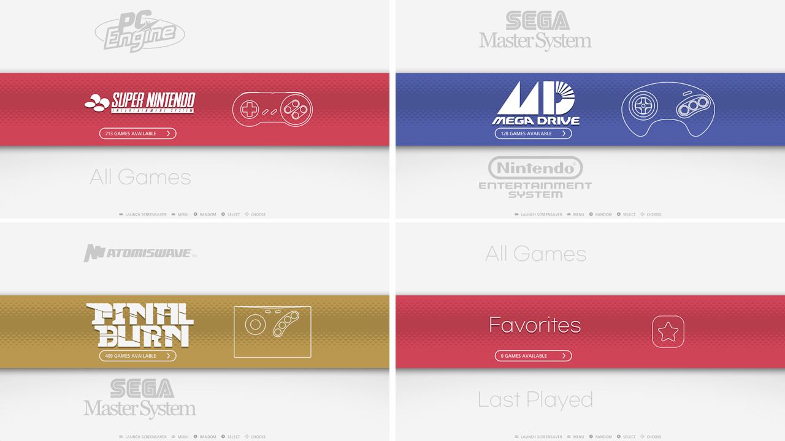
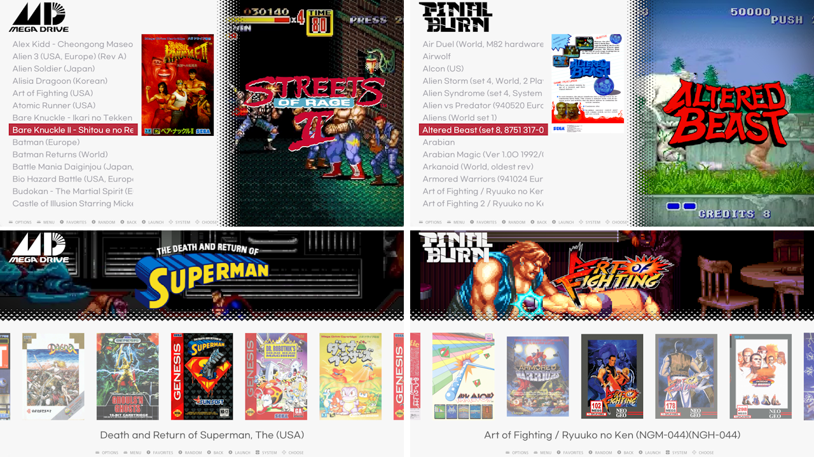
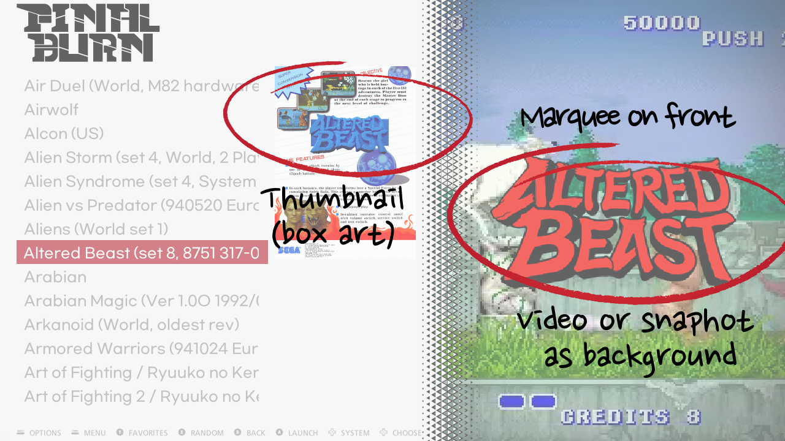

# ssimple VL - theme for Retropie Emulationstation
Theme 'SSIMPLE VL'\
Landcape version of SSIMPLE V theme - https://github.com/losernator/es-theme-ssimple-ve
 
## Changelog
- v 1.5 seperate from vertical theme

## How to use

### Recommended theme option:
- UI SETTINGS > TRANSITION STYLE: INSTANT
- UI SETTINGS > CAROUSEL TRANSITIONS: SLIDE (or NONE)

**You may need properly scrapped gamelist.xml-including video, image, marquee, thumbnail- for more organized view**

### Compatibility
tested on 1920x1080 and 1280x720 resolution.

### Another aspect ratio

- theme.xml : 16:9 Landscape
- theme-nothumb.xml : 16:9 Landscape with no thumbnail tag
- theme-L43.xml : 4:3 Landscape
- theme-mini.xml : Large font for handheld

** rename original 'theme.xml' to 'theme.xml.ori' and then rename other file to 'theme.xml'**\
  eg : theme-L43.xml to theme.xml will set the theme to 4:3 screen

## License

## LOGO NOTICE
* The used logos and trademarks are copyright of their respective owners.

## Screenshots

## Video
